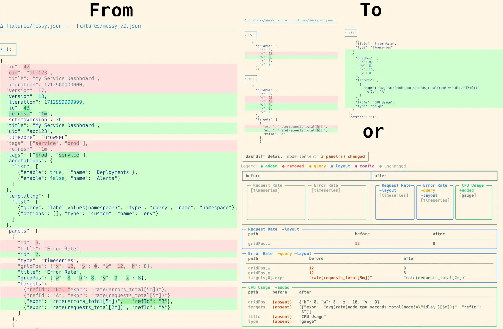

# dashdiff

Git diff helpers for Grafana dashboard JSON files.

When storing Grafana dashboards in git, `git diff` tends to produce walls of noise: `dashdiff` normalises the JSON into a stable, human-readable representation so that Git shows only meaningful changes, and provides a visual box-model diff in the terminal.


---

## Installation

```bash
pip install '.[visual]'
# or, with uv:
uv tool install '.[visual]'
```

This places a single `dashdiff` executable on your `$PATH`.

---

## Subcommands

```
dashdiff normalize (n)   Normalise a dashboard file → stdout
dashdiff diff      (d)   Unified text diff of two normalised files
dashdiff visual    (v)   Rich terminal box-model grid visualiser
dashdiff detail    (t)   Grid visualiser interleaved with per-panel change details
dashdiff gittool   (g)   GIT_EXTERNAL_DIFF adapter (not for direct use)
```

All subcommands accept `--strict` to use strict normalisation mode (see below).

---

## Git integration

There are three independent mechanisms for wiring `dashdiff` into Git. They serve different purposes and can be used together.

### 1. `textconv` — for `git diff`, `git show`, `git log -p`

The `textconv` mechanism tells Git to pass the JSON file through a normaliser *before* computing the diff.

**Setup:**

```bash
git config --global diff.grafana-dashboard.textconv 'dashdiff normalize'
```

In your repository's `.gitattributes`:

```gitattributes
dashboards/**/*.json  diff=grafana-dashboard
```

**Usage:**

Run `git diff` or `git show` as normal. The output will be a standard unified diff with all cosmetic JSON noise stripped away.

To use strict mode: `git config diff.grafana-dashboard.textconv 'dashdiff normalize --strict'`

---

### 2. `git difftool` — for interactive side-by-side review

`dashdiff detail` (or `visual`) renders the dashboard as a box-model grid. In two-file mode, changed panels are highlighted with a coloured border indicating the type of change (e.g. green for added, red for removed, yellow for query changes). The `detail` subcommand also prints a flat dotted-path list of exactly what changed inside each panel.

**Setup:**

```bash
git config --global difftool.dashdiff.cmd 'dashdiff detail "$LOCAL" "$REMOTE"'
git config --global difftool.prompt false
```

**Usage:**

```bash
git difftool --tool=dashdiff -- dashboards/my-dashboard.json
```
*(Note: the `--` separator is required so Git knows it is a file path, not a branch name).*

Tip: add an alias to your shell profile:

```bash
alias gdd='git difftool --tool=dashdiff --no-prompt HEAD --'
```

---

### 3. `GIT_EXTERNAL_DIFF` — for replacing `git diff` output entirely

`dashdiff gittool` is a `GIT_EXTERNAL_DIFF` adapter. Git passes 7 positional arguments (`path old-file old-hex old-mode new-file new-hex new-mode`); `gittool` unpacks them and delegates to `dashdiff detail`.

**Setup:**

```bash
git config --global diff.grafana-visual.command 'dashdiff gittool'
```

In your repository's `.gitattributes`:

```gitattributes
dashboards/**/*.json  diff=grafana-visual
```

**Usage:**

```bash
git diff -- dashboards/my-dashboard.json
```

Git bypasses its internal text diff engine and prints the visual grid and path breakdown directly to the terminal.

---

### Diffing against a committed version

```bash
# With process substitution (bash/zsh)
dashdiff visual <(git show HEAD:dashboards/my-dashboard.json) my-dashboard.json

# Portable (any shell)
git show HEAD:dashboards/my-dashboard.json > /tmp/committed.json
dashdiff visual /tmp/committed.json my-dashboard.json

# Against any ref
dashdiff visual <(git show main:dashboards/my-dashboard.json) my-dashboard.json
```

Shell function for convenience:

```bash
gdashboard-diff() {
    local file="$1" ref="${2:-HEAD}"
    dashdiff visual <(git show "${ref}:${file}") "${file}"
}
```

---

## Normalisation modes

The normaliser operates in two modes, controlled by the `--strict` flag.

```bash
dashdiff normalize dashboard.json           # lenient (default)
dashdiff normalize --strict dashboard.json  # strict
```

### Fields stripped in both modes

| Field          | Reason                                                                           |
|----------------|----------------------------------------------------------------------------------|
| `id`           | Database-generated integer; meaningless outside the originating Grafana instance |
| `iteration`    | Unix millisecond timestamp written on every save                                 |
| `version`      | Auto-incremented save counter                                                    |
| `panels[*].id` | Integer assigned by the UI; shifts when panels are added or removed              |
| `null` values  | Stripped entirely in lenient mode; preserved in strict mode                      |

### Array normalisation

| Array                          | Lenient (default)                         | Strict                                    | Rationale                                                             |
|--------------------------------|-------------------------------------------|-------------------------------------------|-----------------------------------------------------------------------|
| `tags`                         | Sorted alphabetically                     | Document order                            | Grafana treats tags as a set; the UI sorts them for display anyway    |
| `panels`                       | Sorted by `(gridPos.y, gridPos.x, title)` | Sorted by `(gridPos.y, gridPos.x, title)` | Visual position is encoded in `gridPos`, not array index              |
| `panels[*].targets`            | Sorted by `refId`                         | Sorted by `refId`                         | `refId` is the stable identity of a query                             |
| `templating.list`              | Sorted by `name`                          | Sorted by `name`                          | Variables are identified by name, not position                        |
| `templating.list[*].options`   | Sorted by `value`                         | Document order                            | Cached option values are re-fetched on load; stored order is cosmetic |
| `annotations.list`             | Sorted by `name`                          | Sorted by `name`                          | Identified by name                                                    |
| `timepicker.refresh_intervals` | Sorted alphabetically                     | Document order                            | Dropdown order is a UI preference with no functional effect           |
| `timepicker.quick_ranges`      | Sorted by `display`                       | Document order                            | Same reasoning as `refresh_intervals`                                 |
| `panels[*].transformations`    | Document order                            | Document order                            | **Pipeline** — reordering transformations changes the output          |
| `panels[*].overrides`          | Document order                            | Document order                            | Later overrides win on the same field; order is significant           |
| `links`                        | Document order                            | Document order                            | Link bar render order is intentional                                  |

All JSON object keys are sorted alphabetically in both modes, eliminating diff noise from arbitrary key ordering in Grafana API output.
